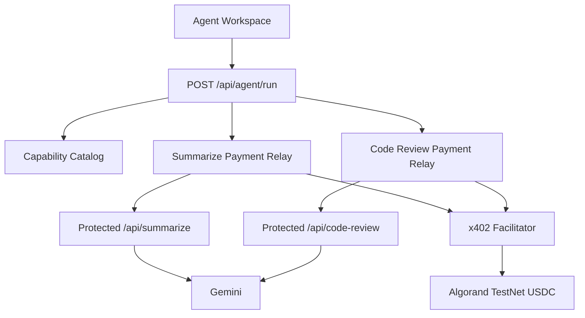
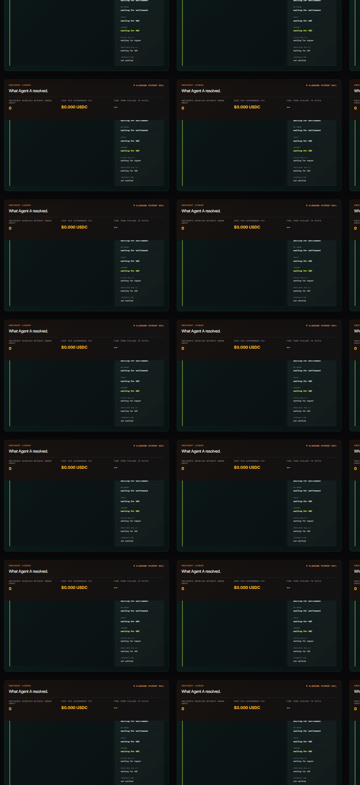
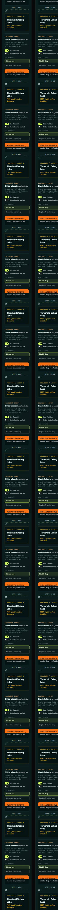

# Threshold

Threshold is an agent-oriented API gateway and x402 marketplace for AI capabilities on the Algorand TestNet.

A user describes an outcome instead of choosing a provider or learning an endpoint. Threshold discovers the matching capability, settles access with USDC through x402, executes the service, and returns the result with a transparent execution trace.

## What It Demonstrates

- Capability discovery from a public API catalog
- Deterministic agent routing
- Automatic x402 payment construction and settlement
- Algorand TestNet USDC payments
- AI text summarization
- AI code review
- Composed code review followed by summarization
- A login-free local Agent Profile console with usage history
- A live capability flow with selectable divide, regional-cache, and dependency-scan scenarios
- Structured patch display, sandbox application, and real test verification
- A repeatable liveness proof for three settlements and the underfunded-wallet failure path

The current demo uses a controlled TestNet payer wallet on the server. This is suitable for a prototype and should be replaced by user- or agent-authorized spending before production use.

## Product Flow

A summary request follows this path:

```text
User task and text
  -> Agent router
  -> Capability catalog
  -> Text summarizer selection
  -> x402 payment relay
  -> Protected summarizer endpoint
  -> Gemini
  -> Summary and settlement trace
```

A combined request follows this path:

```text
Code and task
  -> Code Review API + x402 settlement
  -> Structured review
  -> Text Summarizer API + x402 settlement
  -> Concise final explanation
```

An incident-resolution request follows this path:

```text
Failing fixture and source files
  -> Agent A tool registration
  -> GET /api/catalog
  -> Matching capability selected
  -> Unpaid POST /api/resolve-incident
  -> HTTP 402 payment terms
  -> x402 USDC signing and facilitator settlement
  -> Paid retry with the same incident payload
  -> Structured diagnosis, unified diff, or security finding
  -> Temporary workspace patch application when a patch is returned
  -> Real fixture test verification or security-feed result
```

## Features

### Agent Workspace

The main workspace supports three modes:

- **Summarize**: summarize supplied text
- **Review code**: inspect code for bugs, security concerns, correctness, and maintainability
- **Review + summarize**: pay for both capabilities and turn the detailed review into a concise explanation

The incident workspace lets the user select the divide bug, regional-cache bug, or dependency vulnerability scan, choose TestNet or MainNet, and trigger an underfunded-wallet failure. Each run returns a live SSE trace containing the selected capability, exact transmitted payload, payment status, transaction ID, and structured result.

### Public Catalog

The catalog is hidden by default so users can focus on the agent workflow. Launch Catalog reveals public capability information only:

- Capability category
- Public service name
- Description
- Price per request

Provider wallet addresses, internal request schemas, and implementation details are not exposed in the primary user experience.

### Agent Profile

The login-free Profile console is stored locally in the browser. It shows:

- Completed runs
- Settled requests
- TestNet USDC spend
- Recent execution history
- Demo agent identity
- Settlement network
- Payment permissions

This is intentionally not a multi-user authentication system yet. The future identity model may use wallet connection, OAuth, or an agent wallet with spending limits.

## Architecture



### Important Layers

- `server/index.ts`: Hono server, static frontend, route registration, x402 middleware, and discovery metadata
- `server/src/catalog/apis.ts`: public capability catalog
- `server/src/services/agent/run.ts`: deterministic agent intent routing and composition
- `server/src/services/payment/summarize.ts`: x402 payer and summarizer relay
- `server/src/services/payment/code-review.ts`: x402 payer and code-review relay
- `server/src/services/payment/incident-flow.ts`: incident fixtures, x402 payment flow, patch application, and sandbox verification
- `server/src/services/security/dependency-scan.ts`: current security-feed fixture lookup for pinned dependencies
- `server/src/services/agent/tools.ts`: explicit `threshold.resolveIncident` tool registration metadata
- `server/src/services/ai/gemini.ts`: Gemini prompts, response parsing, and provider error handling
- `server/public/index.html`: application shell and Agent Profile sections
- `server/public/app.js`: agent interactions, catalog disclosure, local activity history, and UI state
- `server/public/style.css`: responsive SaaS-style visual system

## API Routes

### Public Agent Route

```http
POST /api/agent/run
Content-Type: application/json
```

Summary request:

```json
{
  "mode": "summarize",
  "task": "Get me a concise summary",
  "text": "Text to summarize"
}
```

Code review request:

```json
{
  "mode": "code-review",
  "task": "Review this code and explain the important issues",
  "code": "function add(a, b) { return a + b; }",
  "language": "javascript"
}
```

Composed request:

```json
{
  "mode": "code-review-and-summarize",
  "task": "Review this code and give me a concise explanation",
  "code": "function add(a, b) { return a + b; }",
  "language": "javascript"
}
```

### Discovery Route

```http
GET /api/catalog
```

Returns public capability metadata used by the agent router and optional catalog disclosure.

### Protected Provider Routes

These routes are protected by x402 middleware and normally called through the paid relays:

```text
GET  /api/test
POST /api/code-review
POST /api/summarize
POST /api/resolve-incident
POST /api/scan-dependencies
```

The browser incident trace is streamed by:

```text
POST /api/agent/run-payment-flow
```

It accepts `network` (`testnet` or `mainnet`), `wallet` (`funded` or `empty`), and `bug` (`divide`, `regional-cache`, or `dependency-scan`).

The demo relays are:

```text
POST /api/code-review/paid
POST /api/summarize/paid
```

## Requirements

- Node.js 20 or newer
- pnpm 11 or newer
- An Algorand TestNet payer account
- A funded TestNet USDC payer account
- A reachable x402 facilitator
- A Gemini API key with available quota

## Setup

Install dependencies from the repository root:

```bash
pnpm install
```

Create a local environment file:

```powershell
Copy-Item .env.example .env
```

Fill in the required values in `.env`:

```env
PORT=4021
AVM_ADDRESS=<valid platform receiver address>
FACILITATOR_URL=https://facilitator.goplausible.xyz
AVM_MNEMONIC=<testnet payer mnemonic>
AVM_PAYER_ADDRESS=<address derived from AVM_MNEMONIC>
PROVIDER_CODE_REVIEW_ADDRESS=<provider receiver address>
PROVIDER_SUMMARIZE_ADDRESS=<provider receiver address>
PROVIDER_SECURITY_SCAN_ADDRESS=<optional security-scan receiver address; defaults to code-review provider>
GEMINI_API_KEY=<gemini api key>
GEMINI_MODEL=gemini-3.5-flash
X402_PRICE="$0.001"
X402_NETWORK=testnet
```

Never commit `.env`, mnemonics, private keys, or API keys. The repository's `.env.example` contains placeholders only.

## Run Locally

Start the development server with watch mode:

```bash
pnpm --dir server dev
```

Or start the server once:

```bash
pnpm --dir server start
```

Open:

```text
http://localhost:4021
```

The server serves the frontend from `server/public` and the API from the same Hono process.

## Deploy For Judging

This project requires a long-running Node service because the incident flow uses SSE,
x402 facilitator requests, and server-side wallet signing. A static host such as GitHub
Pages cannot run the complete demo.

The repository includes [`render.yaml`](render.yaml) for Render. To deploy:

1. Create a new Render Blueprint and select this GitHub repository.
2. Render reads `render.yaml`, installs the pnpm workspace, and starts `pnpm --dir server start`.
3. Enter the `sync: false` values in Render's environment settings. Copy them from your local
  `.env` without committing them.
4. Keep `X402_NETWORK=testnet` for judging and wait for `/api/catalog` to pass its health check.
5. Open the deployed `onrender.com` URL and run the flow from the browser.

Required secret values are `AVM_ADDRESS`, `AVM_MNEMONIC`, `AVM_PAYER_ADDRESS`,
`PROVIDER_CODE_REVIEW_ADDRESS`, `PROVIDER_SUMMARIZE_ADDRESS`, `GEMINI_API_KEY`, and
optionally `PROVIDER_SECURITY_SCAN_ADDRESS`. `FACILITATOR_URL` and the non-secret demo
settings are already defined in the blueprint.

## Validation

Run the TypeScript check:

```bash
pnpm --dir server typecheck
```

Run the direct payment tests:

```bash
pnpm --dir server run test:pay
pnpm --dir server run test:pay:resolve-incident
pnpm --dir server run test:pay:summarize
pnpm --dir server run test:pay:code-review
```

These tests verify the complete 402 -> sign -> settle -> retry flow against the local protected routes.

Run the live proof command with the server already running and a funded TestNet payer:

```bash
pnpm --dir server run test:verify-liveness
```

It performs three sequential funded flows, asserts unique settlement transaction IDs and
timestamps, confirms payer/provider wallet fields are present and stable, then runs the
empty-wallet flow and requires the `Payment failed: insufficient funds` SSE event. The
funded payer is expected to stay stable; a changing payer would indicate an authorization
or wallet-identity problem, not liveness.

## Payment Flow

1. A request reaches a protected provider route.
2. x402 returns `402 Payment Required` with payment requirements.
3. The relay constructs an exact USDC payment for Algorand TestNet.
4. The configured payer signs the transaction.
5. The facilitator verifies and settles the payment.
6. The relay retries the original request with payment proof.
7. The provider route calls Gemini.
8. Threshold returns the AI result and settlement transaction metadata.

The incident-resolution price is `$0.001 USDC` per request. The dependency vulnerability
scan and composed review-plus-summary flow cost `$0.002 USDC`.

For hackathon judging, keep `X402_NETWORK=testnet`. A successful run produces a fresh
Algorand TestNet transaction and links it to:

```text
https://lora.algokit.io/testnet/transaction/<transaction-id>
```

The live trace also identifies the configured GoPlausible facilitator and exposes the
catalog selection reason plus rejected alternative capabilities. The underfunded-wallet
toggle exercises the same SSE flow and emits a real payment failure event.

The incident flow sends the literal request body as JSON. Bug scenarios include source
files, test files, error name/message/stack, runtime, language, and constraints. The
dependency scenario sends its pinned dependency manifest to `/api/scan-dependencies`.
After payment, a returned unified diff is applied with `git apply` inside a temporary
verification workspace. The selected fixture test runs against the modified file, and
the flow emits `Verification passed` only when that test succeeds. Security scans instead
return a structured finding from a clearly labeled OSV-compatible mock feed. This sandbox
keeps the demo honest without modifying the repository running the server.

For manual hash inspection, start the server with
`THRESHOLD_KEEP_VERIFICATION_WORKSPACE=true`. The server terminal prints the absolute
patched-file path and full SHA-256 hash after verification. Compare the file yourself:

```powershell
Get-FileHash "C:\path\printed-by-threshold\src\math.ts" -Algorithm SHA256
```

The preserved directory is temporary verification evidence, not the user's project.

## Troubleshooting

### Gemini quota error

A response such as:

```text
AI provider quota is temporarily exhausted
```

means Gemini returned HTTP 429. Wait for the quota reset, use a key with available quota, or configure a model available to the account.

### Payer address mismatch

`AVM_PAYER_ADDRESS` must match the address derived from `AVM_MNEMONIC`. The direct payment scripts validate this before attempting settlement.

### Facilitator timeout

If the facilitator is unavailable, the server may start but payment-backed requests will fail. Check `FACILITATOR_URL`, network connectivity, and facilitator availability.

### Port already in use

Stop the process using port `4021`, or set another `PORT` in `.env` and restart the server.

## Security Notes

- Keep `.env` local and never commit secrets.
- Use TestNet accounts and assets for this prototype.
- The server-side payer is a demo convenience, not a production custody model.
- Production payments should use user or agent authorization, spending limits, provider allowlists, and durable audit records.
- Public catalog data should not expose private keys, mnemonics, or internal infrastructure details.

## Current Scope

Threshold is intentionally focused on proving the agent capability loop with incident resolution, code review, summarization, and dependency vulnerability intelligence. The incident demo includes three independently selectable scenarios: an arithmetic defect in `src/math.ts`, a regional cache-key isolation defect in `src/cache/userLookup.ts`, and a pinned dependency matched against a clearly labeled OSV-compatible security-feed fixture. Patch verification happens in a temporary workspace; the current server does not modify the user's actual project. The next production-oriented steps would be durable server-side activity records, wallet or OAuth identity, user-configurable spending limits, provider quality signals, and applying approved patches in a user's actual workspace.


## Screenshots
Current site screenshots captured from the local server at `http://localhost:4021`:





